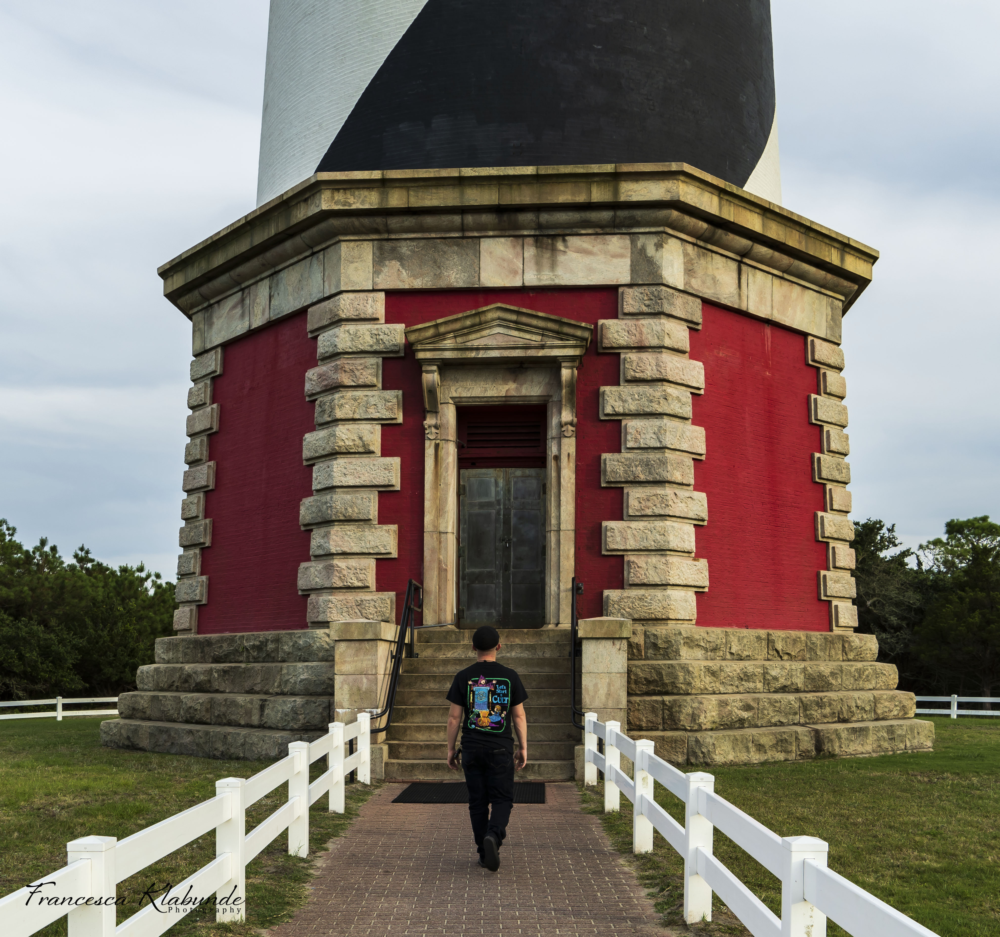

# carpe-vox-ws
Git repository for Carpe Vox Website

To be used on a contact page for editor.

New files Created: Jan 14 2021
cryptids.html: Cryptid Encounters Home page
        Will be used as a home page to organize Cryptid encounter stories, either by submission or editor research. 

ghosts.html: Ghost Stories Home Page
        Will be used as a home page to organize Ghost stories, either by submission or editor research.

submissions.html: Submitted Spooks Home Page
        Will be used as a home page to organize submitted stories by submission. Must have some sort of proof or contact. Witness accounts in the form of email, phone call, pictures, etc will be turned into a web page and cataloged on submissions.html.

For Developer/Editor questions/comments/concerns with source code, please email me. 

If you are an interested paranormal enthusiast and want to help get behind the #SeektheTruth movement for paranormal research, please also shoot me an email. Add Carpe Vox in the subject and mark it as important. 

Thank you and hope any users enjoy both the source code and the finished content.

Steven Klabunde
klabunde.b.steven (at) gmail.com